ssh -i ~/.ssh/AWS_key.pem ubuntu@13.115.69.248

### 剛連上初始化：

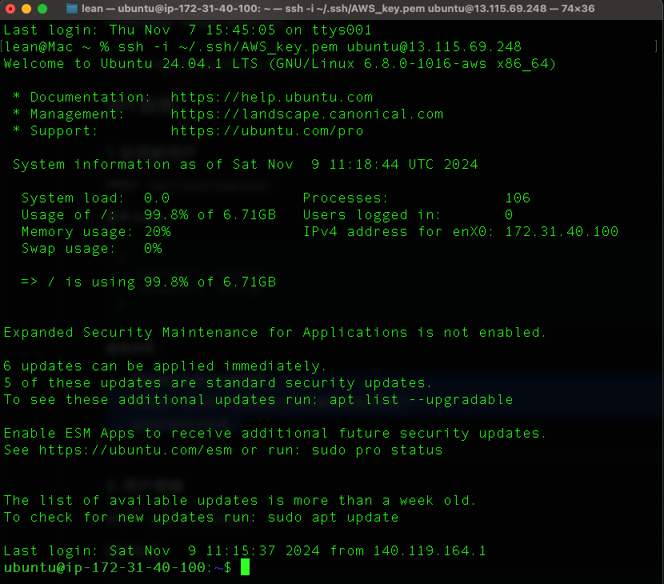

### 執行 curl localhost

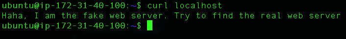

### 問題

在剛連上有顯示整個系統的資訊，我發現有一個地方比較奇怪，就是他的容量已經使用了99.8%，這應該可能在系統裡面有一些問題，對於電腦吃太多的容量對於電腦好像不太好，所以我透過以下指令：

```python
sudo du -h --max-depth=1 / | sort -hr | head -n 10
```

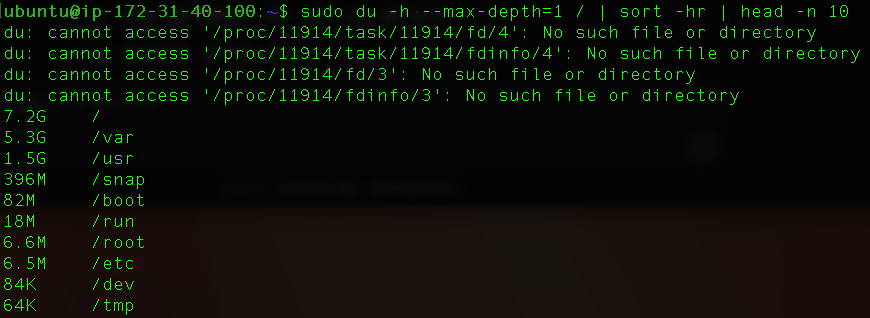

- **`du -h --max-depth=1 /`**：
    - `du`（disk usage）：用於顯示文件和目錄佔用的磁碟空間大小。
    - `h`（human-readable）：將輸出轉換為人類可讀格式，例如 KB、MB、GB。
    - `-max-depth=1`：只顯示指定深度的目錄大小。`1` 表示只查看指定目錄 `/` 下的直接子目錄，不會遞歸到更深的層次。
    - `/`：指定要查看的根目錄。
- **`| sort -hr`**：將輸出的結果按大小從大到小排序。
    - `sort`：排序指令。
    - `h`：根據人類可讀格式（KB、MB、GB）進行排序。
    - `r`：反向排序，從大到小排列。
- **`| head -n 10`**：只顯示前 10 行結果，這樣可以看到佔用空間最大的 10 個子目錄或文件。

我找到 /var/log/system 裡面有四個largefile


把它刪除

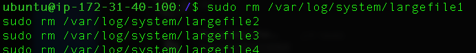

檢查刪除過後的檔案大小

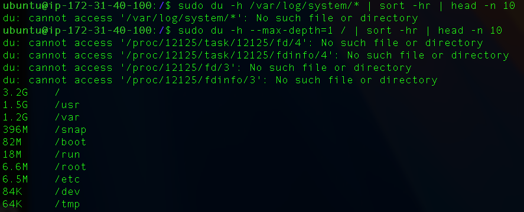

這個指令是檢查目前系統哪些 port 目前被佔用，然後再去看 tcp 的 80 port 目前是被 nginx佔用嗎？

不是，目前的 80 port 是被 srv 這個 command 給佔用，所以我應該把它給關掉，然後開啟 nginx 的服務

```python
sudo ss -tuln
sudo lsof -i :80
```

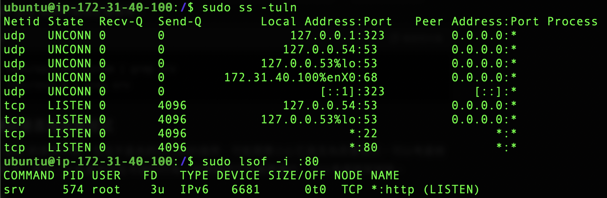

現在我已經刪除這個 80 port PID 了，現在我要看一下 nginx 的服務，出現了一些錯誤的訊息，

- 從錯誤訊息來看，NGINX 無法啟動的原因是配置檔案 `/etc/nginx/nginx.conf` 中出現了 **unexpected ";"** 的語法錯誤。

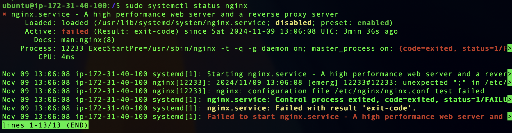

所以我進去看一下 nginx 的配置檔案，`sudo nano /etc/nginx/nginx.conf` 

得確有一個 ; 的語法錯誤

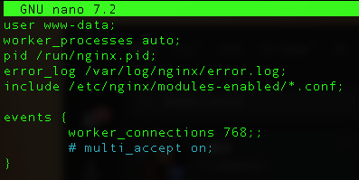

修改完後，重新啟動 nginx 但發現還是有錯誤，所以沒有辦法看到正確的回應

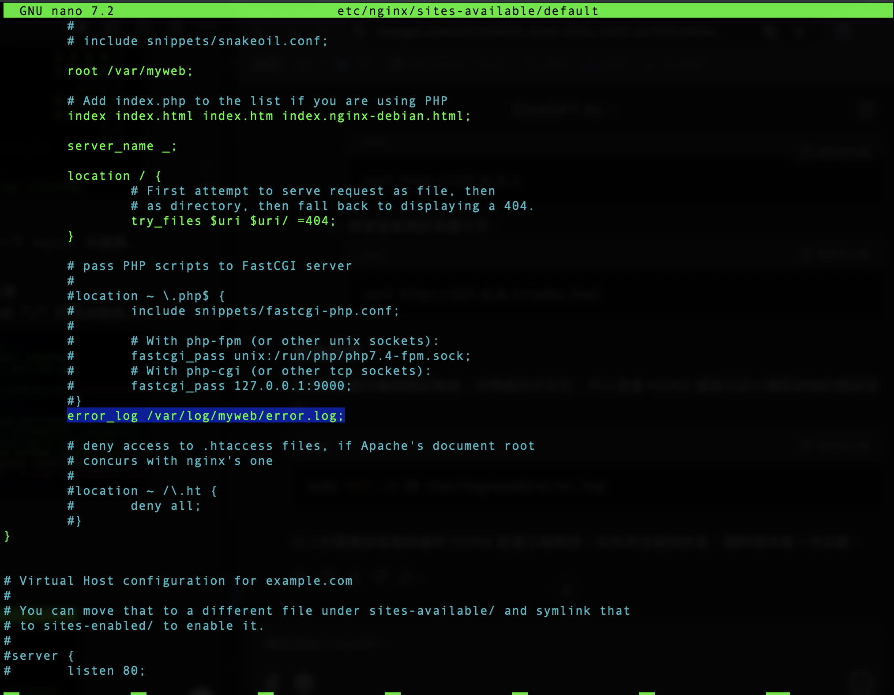

我發現`etc/nginx/sites-available/default` 裡面default 值需要再做一些設定

這行指令讓 NGINX 在 IPv6 的埠口 80 上監聽，並且也將其設為默認伺服器。

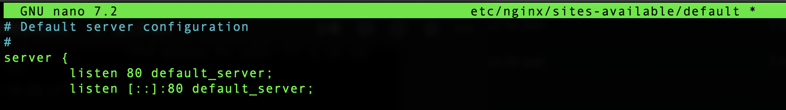

不然他會報錯！


修改完後就有以下的畫面：

出現 403 forbidden ，這通常是因為權限的問題，導致 nginx 無法訪問 /var/myweb的內容

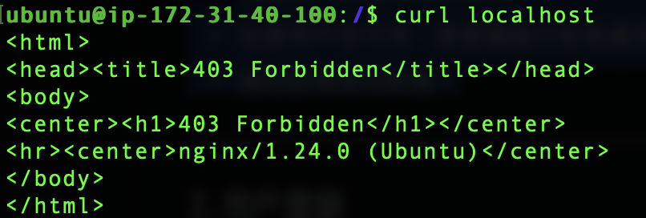

所以我們只要去修改這個路徑的權限就可以有權限去訪問這個檔案了：

`sudo chmod -R 755 /var/myweb` 

- **`chmod`**：這個命令用來改變文件或目錄的權限（access permissions）。
- **`R`**：表示遞歸（recursive），即將權限應用到目錄 `/var/myweb` 及其子目錄和文件中。
- **`755`**：這是權限設置的數字表示法，代表「所有者可讀、可寫、可執行，群組和其他用戶可讀和可執行」：
    - **7**（所有者）= 讀取（4）+ 寫入（2）+ 執行（1）= 7
    - **5**（群組）= 讀取（4）+ 執行（1）= 5
    - **5**（其他用戶）= 讀取（4）+ 執行（1）= 5

`sudo chown -R www-data:www-data /var/myweb`

- **`www-data:www-data`**：指定擁有者和群組為 `www-data`，這是 NGINX 通常使用的用戶和群組名稱。
    - **第一個 `www-data`** 是文件或目錄的所有者。
    - **第二個 `www-data`** 是文件或目錄的群組。
    
    將 `/var/myweb` 及其內容的擁有者設置為 `www-data`，可以確保 NGINX 有權限訪問和讀取該目錄及其文件。
    

這樣一來就可以使用`curl localhost` 去訪問正確的程式了！

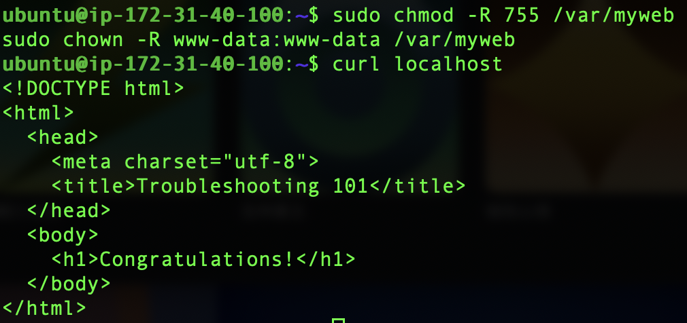
